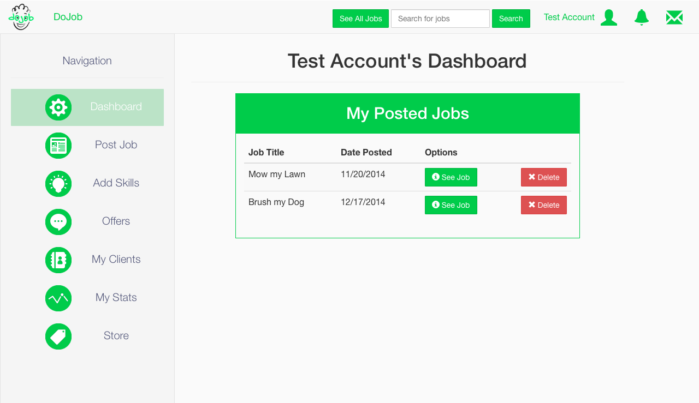
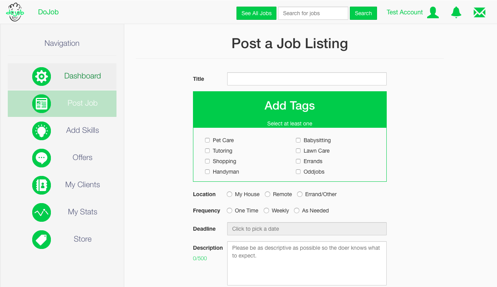
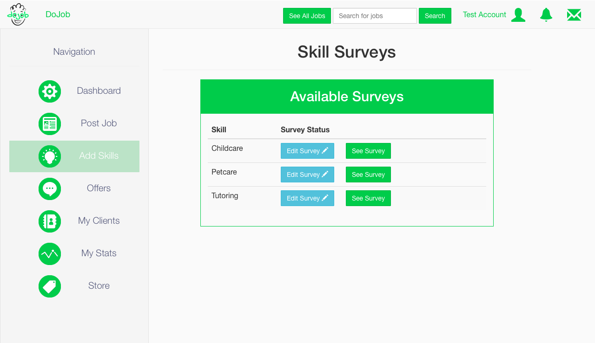
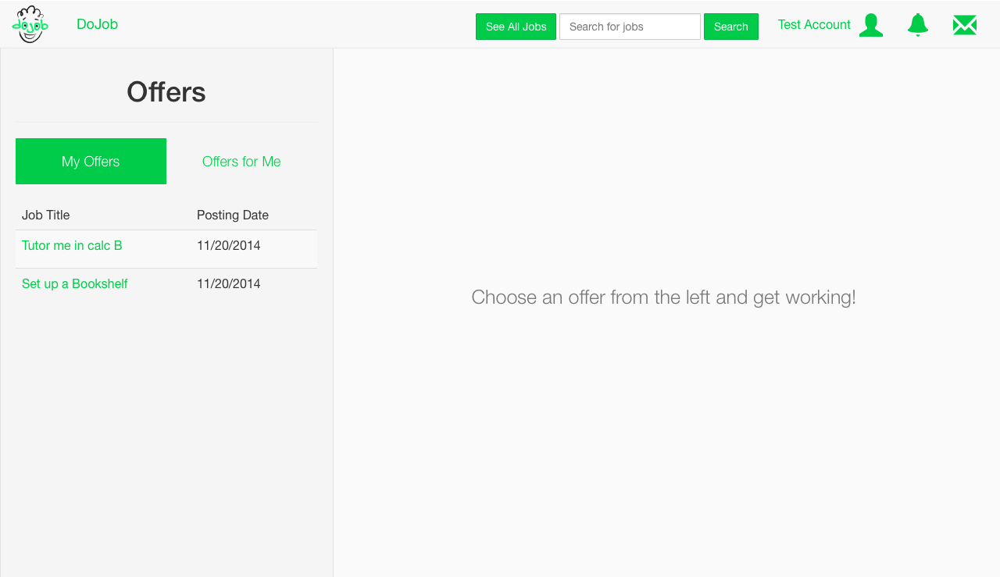
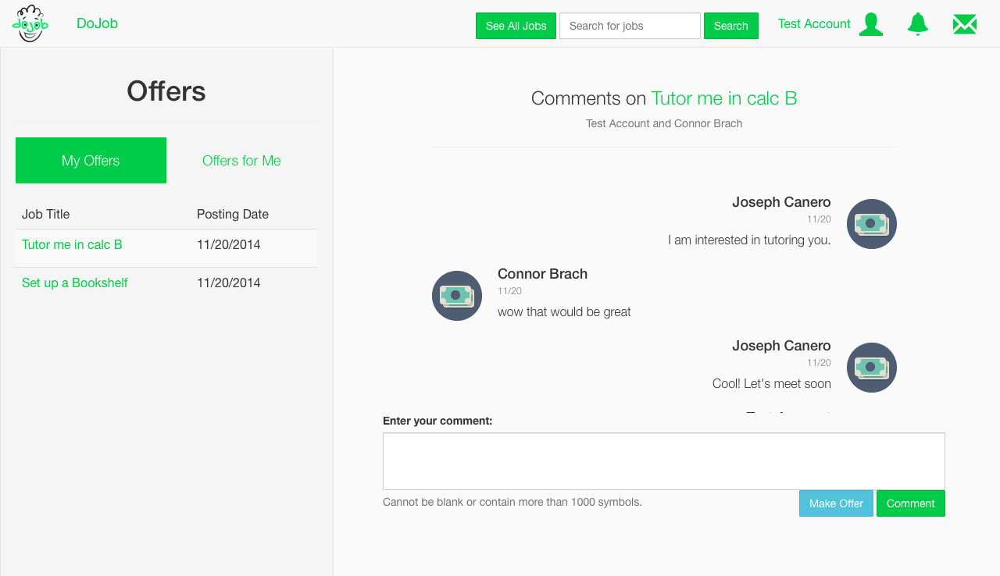
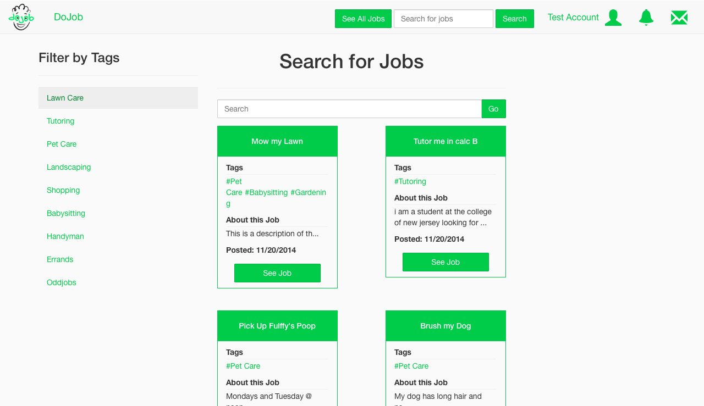
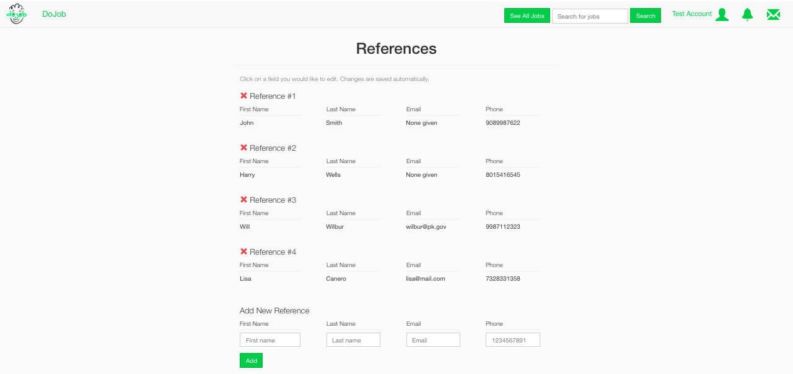
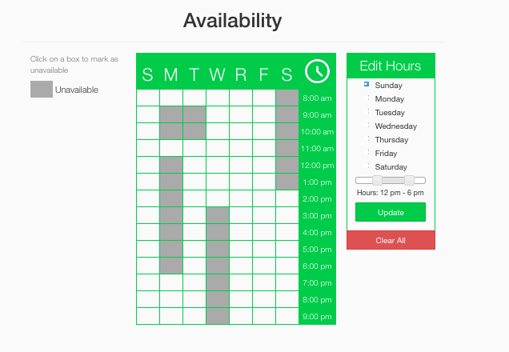
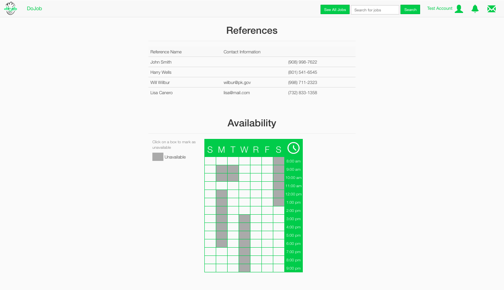

<h1>Dojob</h1>

Dojob is a Ruby on Rails application I am working on that will allow college students to get in touch with people in the surrounding areas to perform quick jobs for easy money. Users can post jobs, and other users can accept those jobs and work on them and get paid. The following is a brief list of some of the kinds of jobs available:

<ul>
<li>Lawncare</li>
<li>Tutoring</li>
<li>Childcare</li>
<li>Petcare</li>
</ul>

It is written in Rails 4, and requires elasticsearch, imagemagick, and faye to run successfully. Once an elasticsearch server is installed, you can run rake elasticsearch:start to start that and then you can run rake faye:start to run the faye server for real-time chat. If imagemagick is not installed, run brew install imagemagick to install it on OS X.

 To start elasticsearch:
elasticsearch --config=/usr/local/opt/elasticsearch/config/elasticsearch.yml

<h2>Screenshots of Dojob</h2>

The following is a screenshot of the main page of the application.

 

After a user logs in, they are taken to their dashboard, where they can see a list of the jobs they've posted.

 

A user can also choose to post a job, which entails filling out some basic information and tagging it.

 

A user is also able to fill out some skill surveys for some of the more important jobs, giving other users some assurance that they are trustworthy and skilled.

 

Once a user makes an offer for a job, or someone has made an offer to them, they are able to see the list of offers and chat in real-time with the appropriate user.

 

 

A user is also able to look at the list of all jobs currently available, as well as filter by tag and search.

 

Each user also has their own profile, which will display their references, certifications, availability and other resume-esque information. Right now, only references and availability are done. This is what it looks like to add a new reference to your list of references.

 

This is what it looks like to update your availability. The user can click within one of the little squares to mark it off as unavailable, or use the menu on the right side to mark off chunks at a time.

 

This what the user profile looks like so far when it is not in edit mode. References and availability are displayed for all users to see.

 
